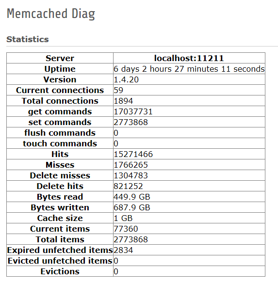

.. ==================================================
.. FOR YOUR INFORMATION
.. --------------------------------------------------
.. -*- coding: utf-8 -*- with BOM.

.. ==================================================
.. DEFINE SOME TEXTROLES
.. --------------------------------------------------
.. role::   underline
.. role::   typoscript(code)
.. role::   ts(typoscript)
   :class:  typoscript
.. role::   php(code)

Features
^^^^^^^^

- Implements a diagnosis backend module for the memcached-servers
  that are used by the caching-framework

- It mainly displays the information retrieved by memcached->getExtendedStats()
  such as
  
  - uptime
  
  - version
  
  - size, written and read bytes
  
  - cache hits and misses

